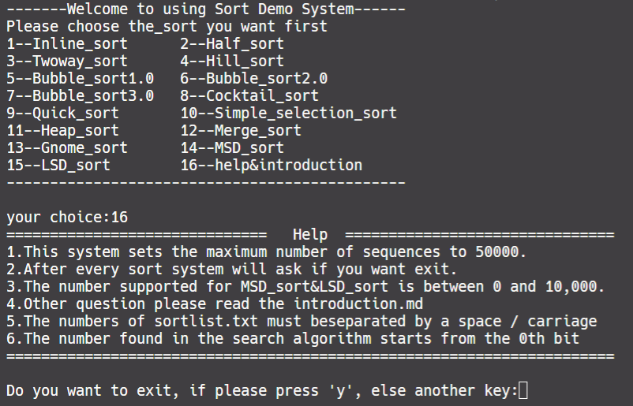

## 作业说明

```cpp
/***
 * @author pengpenglang
 * @date: 2019-09-09
 * @language: cpp
 * @info: 大一上 程序设计课（高级班） 排序算法上机实验
 */
```

## 项目说明

### 基本功能

- 小白零基础编写，代码捡漏🤣，仅供参考❗️
- 单文件实现，共包括如下`15`个算法
  - 不一定都能够到达`1e5`的运算量
  - `LSD` 排序从网上摘了一个源码调试最终仍未成功

<table>
    <tr>
        <td>1-✔️插入排序</td>
        <td>2-✔️折半排序</td>
        <td>3-✔️二路排序</td>
        <td>4-✔️希尔排序</td>
    </tr>
    <tr>
        <td>5-✔️冒泡排序</td>
        <td>6-✔️冒泡排序优化一</td>
        <td>7-✔️冒泡排序优化二</td>
        <td>8-✔️鸡尾酒排序</td>
    </tr>
    <tr>
        <td>9-✔️快速排序</td>
        <td>10-✔️简单选择排序</td>
        <td>11-✔️堆排序td>
        <td>12-✔️归并排序</td>
    </tr>
    <tr>
        <td>13-✔️地精排序[GNOME]</td>
        <td>14-✔️计数排序[MSD]</td>
        <td>15-❌基数排序[LSD]</td>
        <td>16-✔️帮助&说明</td>
    </tr>
</table>


### 其他功能

* 插入排序与折半排序后可以选择进行查找算法
* 统计排序运行时间

### In/Out

* 控制台输入输出
* 文件流输入输出
  * 待排序数据存放在`D://`下的`sortlist.txt`
  * 格式要求：第一行给出数据数量，第二行空格间隔输入每个数

## 运行截图



