[TOC]

## 作业说明

```cpp
/***
 * @author pengpenglang
 * @date: 2019-09-09
 * @info: 大一上 程序设计课（高级班） 排序算法上机实验
 */
```

## 作业说明

- 小白零基础编写，代码捡漏🤣，仅供参考❗️
- 单文件实现，共包括如下`15`个算法
  - 勾选的基本可以输出正确排序结果，但是不一定都能够到达`1e5`的运算量
  - `LSD` 排序从网上摘了一个源码调试最终仍未成功，**注意 LSD 排序尚未成功实现**
    - [x] 插入排序
    - [x] 折半排序
    - [x] 二路排序
    - [x] 希尔排序
    - [x] 冒泡排序
    - [x] 冒泡排序优化一
    - [x] 冒泡排序优化二
    - [x] 鸡尾酒排序
    - [x] 快速排序
    - [x] 简单选择排序
    - [x] 堆排序、归并排序
    - [x] GNOME排序（地精排序）
    - [x] 计数排序（MSD）
    - [ ] 基数排序（LSD）

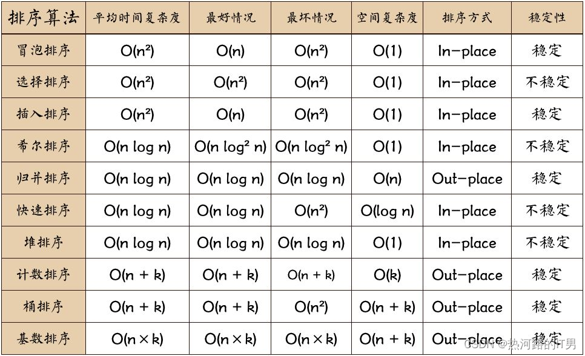

## In/Out

* 控制台
* 文件读写
  * 待排序数据存放在`D://`下的`sortlist.txt`
  * 格式要求：第一行给出数据数量，第二行空格间隔输入每个数

## 其他功能

* 插入排序与折半排序后可以选择进行查找算法

* 统计排序运行时间

## 运行截图

1.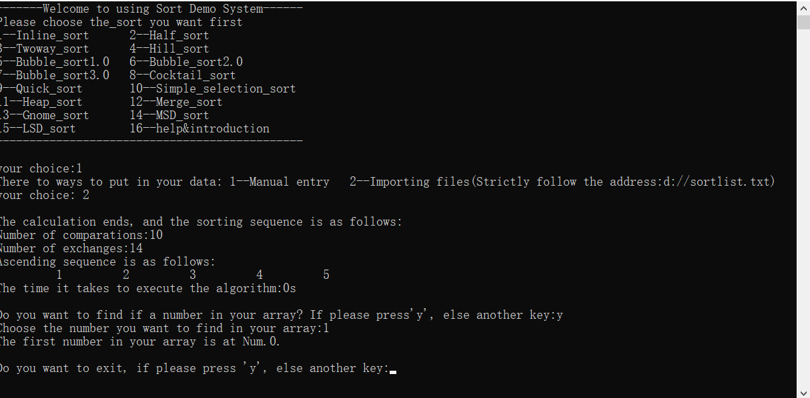

2.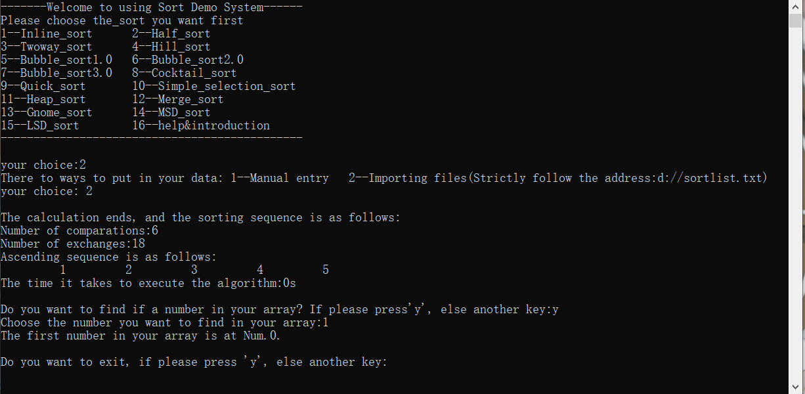

3.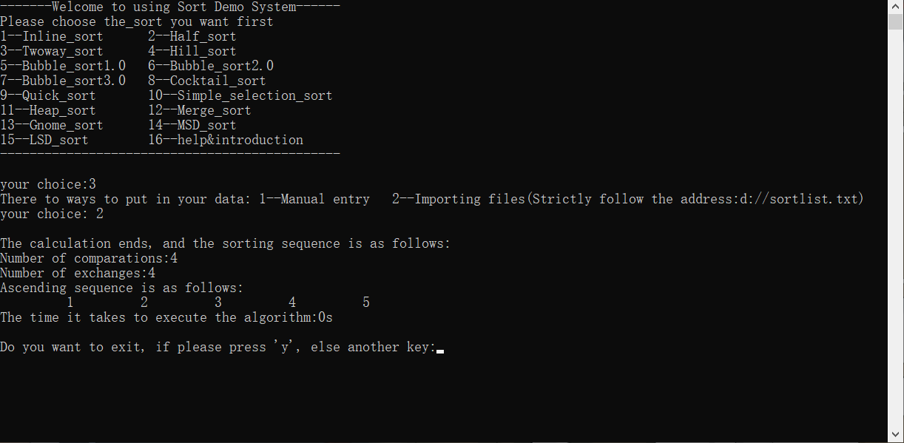

4.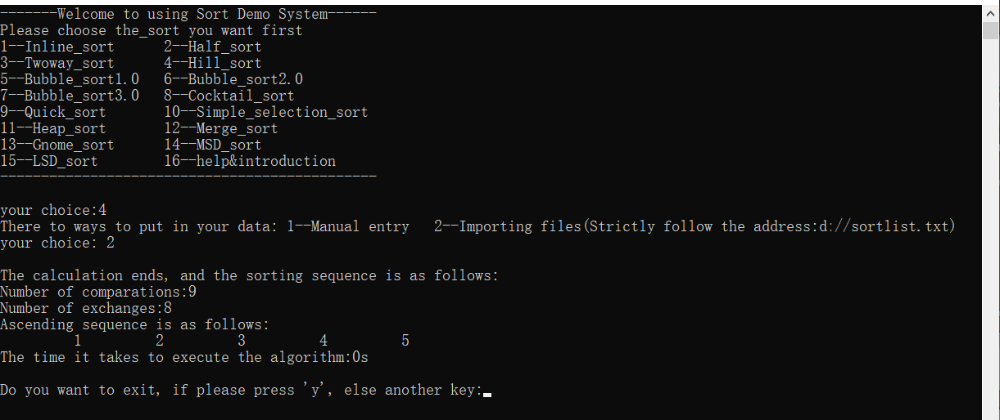

5.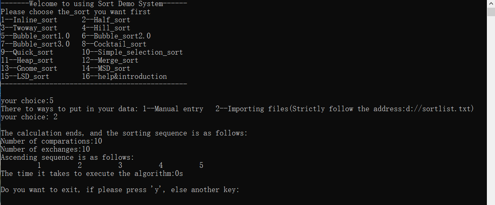

6.

7.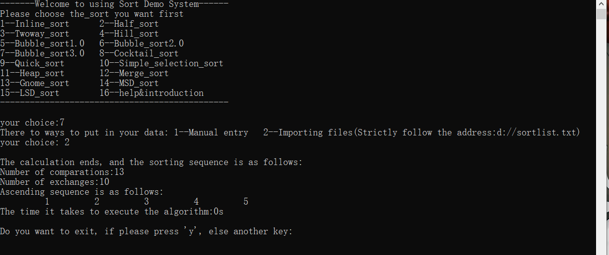

8.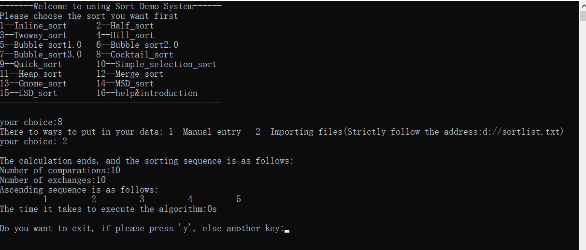

9.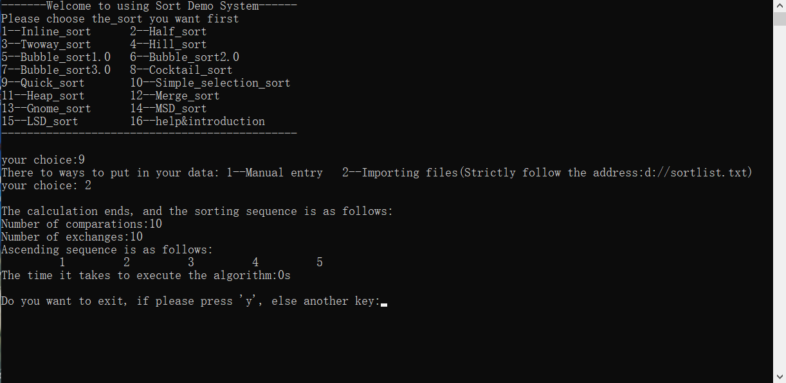

10.

11.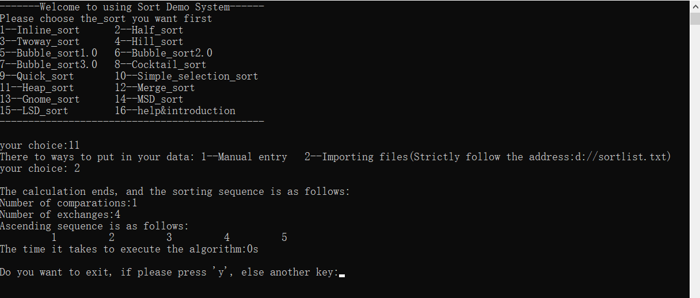

12.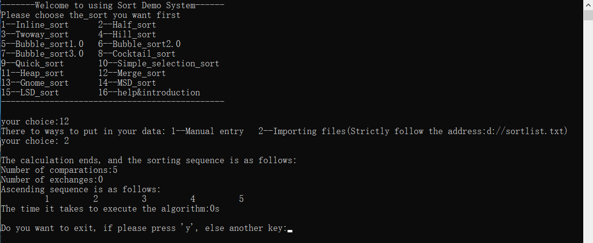

13.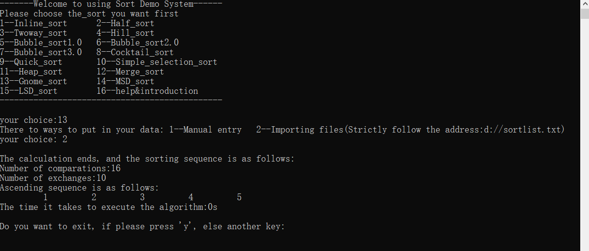

14.

15.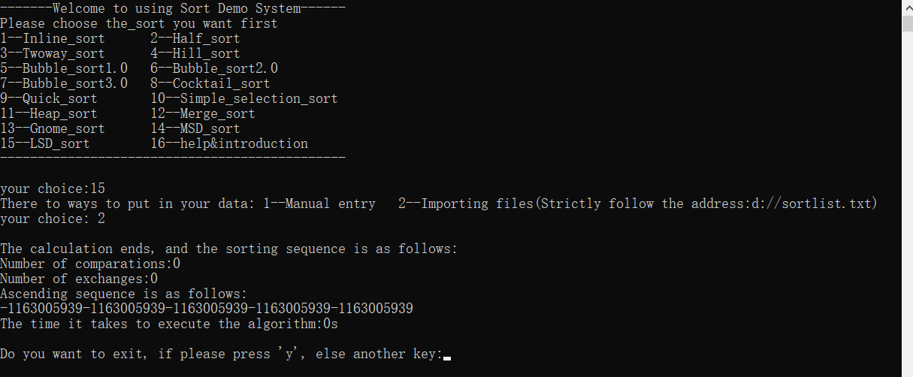

> 最后一个算法有问题哈，准确的说应该是排序成功了，应该是我没调对把临时数组的数弄丢了或者什么其他的原因吧，总之没成功输出正确排序结果😁
